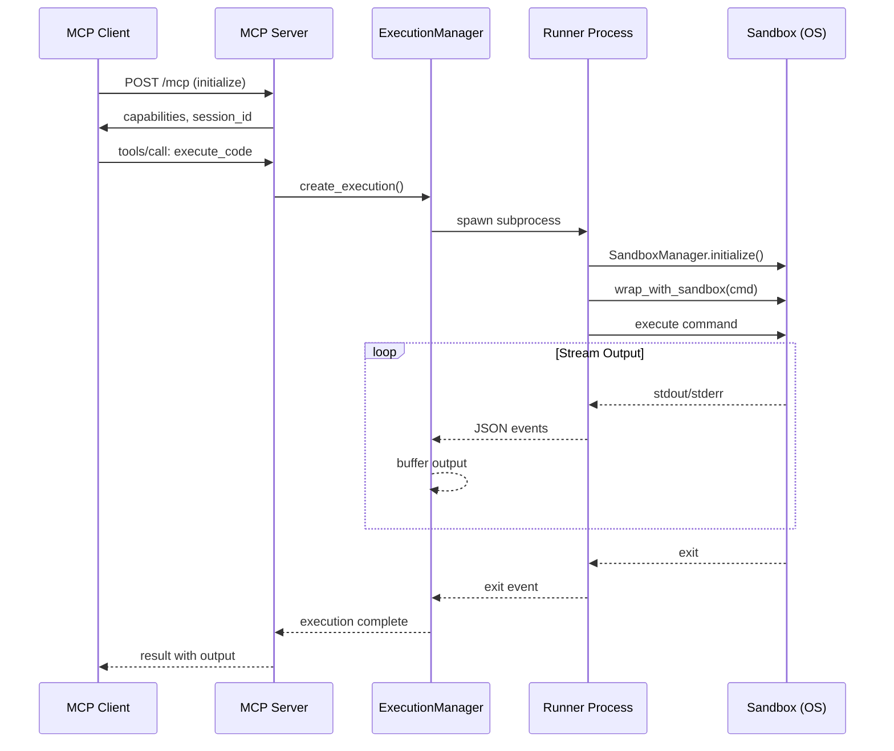

# Sandbox MCP Server

An MCP (Model Context Protocol) server that provides sandboxed code execution with streaming output. Built on FastMCP with Streamable HTTP transport.

## Architecture


## Key Components


## Installation

```bash
# Install with server dependencies
uv sync --extra server

# Or with pip
pip install sandbox-runtime[server]
```

## Quick Start

### Start the Server

```bash
# Default: localhost:8080
srt-mcp-server

# Custom port
SANDBOX_PORT=9000 srt-mcp-server

# All options via environment
SANDBOX_HOST=0.0.0.0 \
SANDBOX_PORT=8080 \
SANDBOX_MAX_CONCURRENT=20 \
SANDBOX_MAX_PER_SESSION=10 \
SANDBOX_TIMEOUT=300 \
srt-mcp-server
```

### Connect with MCP Client

```python
from mcp import ClientSession
from mcp.client.streamable_http import streamablehttp_client

async with streamablehttp_client("http://localhost:8080/mcp") as (read, write, _):
    async with ClientSession(read, write) as session:
        await session.initialize()

        # Execute code
        result = await session.call_tool(
            "execute_code",
            arguments={"command": "echo hello world"}
        )
        print(result)
```

## Tools

### execute_code

Execute a command and wait for completion.

```json
{
  "name": "execute_code",
  "arguments": {
    "command": "echo hello && sleep 1 && echo done",
    "timeout_seconds": 60,
    "interactive": false,
    "working_directory": "/tmp",
    "environment": {"FOO": "bar"},
    "sandbox_config": {
      "network": {"allowed_domains": ["example.com"]},
      "filesystem": {"allow_write": ["/tmp"]}
    },
    "wait_for_completion": true
  }
}
```

**Response:**
```json
{
  "execution_id": "f878c87e-d3e4-4afe-b9fd-996b3c4f8d12",
  "status": "completed",
  "exit_code": 0,
  "output": [
    {"type": "ready", "ts": 1735550000.1},
    {"type": "stdout", "data": "hello", "ts": 1735550000.2},
    {"type": "stdout", "data": "done", "ts": 1735550001.2},
    {"type": "exit", "code": 0, "duration_ms": 1100, "ts": 1735550001.3}
  ]
}
```

### execute_code_async

Start a command without waiting (for long-running tasks).

```json
{
  "name": "execute_code_async",
  "arguments": {
    "command": "sleep 60 && echo finished"
  }
}
```

**Response:**
```json
{
  "execution_id": "abc-123",
  "status": "running"
}
```

### get_execution_output

Retrieve output from an execution.

```json
{
  "name": "get_execution_output",
  "arguments": {
    "execution_id": "abc-123",
    "wait": true
  }
}
```

### send_stdin

Send input to an interactive execution.

```json
{
  "name": "send_stdin",
  "arguments": {
    "execution_id": "abc-123",
    "input_data": "user input\n"
  }
}
```

### cancel_execution

Cancel a running execution.

```json
{
  "name": "cancel_execution",
  "arguments": {
    "execution_id": "abc-123",
    "force": false
  }
}
```

### list_executions

List all executions for the current session.

```json
{
  "name": "list_executions",
  "arguments": {}
}
```

### get_execution_status

Get detailed status of an execution.

```json
{
  "name": "get_execution_status",
  "arguments": {
    "execution_id": "abc-123"
  }
}
```

## Execution Flow



## Configuration

### Environment Variables

| Variable | Default | Description |
|----------|---------|-------------|
| `SANDBOX_HOST` | `127.0.0.1` | Server bind address |
| `SANDBOX_PORT` | `8080` | Server port |
| `SANDBOX_MAX_CONCURRENT` | `10` | Max concurrent executions (global) |
| `SANDBOX_MAX_PER_SESSION` | `5` | Max concurrent executions per session |
| `SANDBOX_TIMEOUT` | `300` | Default execution timeout (seconds) |

### Sandbox Configuration

Each execution can override sandbox settings:

```python
sandbox_config = {
    "network": {
        "allowed_domains": ["api.github.com", "*.example.com"],
        "denied_domains": ["evil.com"],
    },
    "filesystem": {
        "deny_read": ["~/.ssh", "~/.aws"],
        "allow_write": ["/tmp", "."],
        "deny_write": [".env", "*.key"],
    },
}
```

## Session Management


- Each MCP session gets a unique UUID
- Executions are isolated per session
- Session cleanup terminates all running executions
- Output is buffered for reconnection scenarios

## Output Events

| Event Type | Description | Fields |
|------------|-------------|--------|
| `ready` | Sandbox initialized | `ts` |
| `stdout` | Standard output line | `data`, `ts` |
| `stderr` | Standard error line | `data`, `ts` |
| `exit` | Command completed | `code`, `duration_ms`, `ts` |
| `timeout` | Execution timed out | `timeout_seconds`, `ts` |
| `error` | Runner error | `message`, `ts` |
| `cancelled` | Execution cancelled | `ts` |

## Security Considerations

1. **Bind to localhost** in development (`SANDBOX_HOST=127.0.0.1`)
2. **Use TLS** in production (reverse proxy recommended)
3. **Validate working_directory** against allowlist if exposing externally
4. **Rate limit** via `SANDBOX_MAX_PER_SESSION`
5. **Timeout protection** via `SANDBOX_TIMEOUT`

## Example: Claude Agent Integration

```python
import asyncio
from anthropic import Anthropic
from mcp import ClientSession
from mcp.client.streamable_http import streamablehttp_client

async def run_agent():
    async with streamablehttp_client("http://localhost:8080/mcp") as (read, write, _):
        async with ClientSession(read, write) as session:
            await session.initialize()

            # List available tools
            tools = await session.list_tools()
            print(f"Available: {[t.name for t in tools.tools]}")

            # Run Python code
            result = await session.call_tool(
                "execute_code",
                arguments={
                    "command": "python -c 'print(sum(range(100)))'",
                    "timeout_seconds": 30,
                }
            )

            # Parse output
            import json
            output = json.loads(result.content[0].text)
            for event in output.get("output", []):
                if event["type"] == "stdout":
                    print(f"Output: {event['data']}")

asyncio.run(run_agent())
```

## Troubleshooting

### Server won't start
- Check if port is already in use: `lsof -i :8080`
- Ensure dependencies are installed: `uv sync --extra server`

### Executions timeout immediately
- Check sandbox dependencies: `srt-py --help`
- On Linux: ensure `bubblewrap` and `socat` are installed
- On macOS: `sandbox-exec` should be available by default

### Session isolation not working
- Each MCP connection gets a unique session UUID
- Verify `Mcp-Session-Id` header is being sent by client
